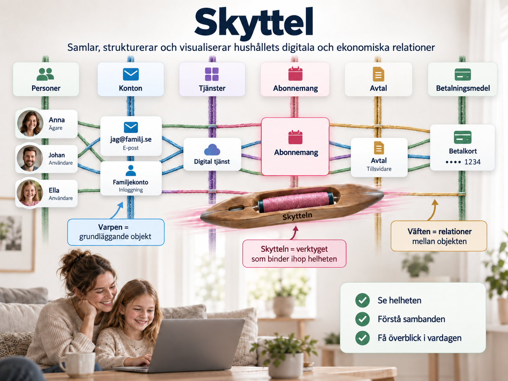

# Skyttel

**Skyttel** är en applikation för att samla, strukturera och visualisera ett hushålls digitala och ekonomiska relationer.

I dag är prenumerationer, konton, avtal, betalningsmedel och användare ofta utspridda över olika tjänster och plattformar. Skyttel skapar en sammanhängande bild av dessa delar och visar inte bara vad som finns, utan också hur allt hänger ihop.

Projektet bygger på en vävmetafor:

* **Varpen** representerar de grundläggande objekten – exempelvis personer, konton, tjänster, abonnemang, avtal och betalningsmedel.
* **Väften** representerar relationerna mellan objekten – vem som äger ett konto, vilket kort som används för betalning, vilket abonnemang som hör till vilken tjänst och vilka personer som använder det.
* **Skytteln** är själva verktyget som binder samman varp och väft och gör helheten begriplig.

Ett abonnemang blir därför mer än bara en återkommande kostnad. Skyttel kan visa vem som äger kontot, vilken e-postadress det är kopplat till, vilket betalningsmedel som används, vilka personer i hushållet som använder tjänsten och vilka andra relationer som finns runt abonnemanget.

Målet med Skyttel är att ge hushållet en gemensam, tydlig och sammanhängande bild av sina digitala tjänster, konton, avtal och åtaganden – och därmed göra det enklare att förstå, administrera och förändra dem över tid.

[Guiden för hushållets tillgång](docs/users/access.md) beskriver roller,
inbjudningar och hur en administratör återkallar tillgång.
[Guiden för objekttyper och egna fält](docs/users/object-types.md) beskriver
hur hushållet skapar och rättar gemensamma definitioner genom sina utkast.
[Guiden för sambandstyper och riktning](docs/users/relationship-types.md)
beskriver egna betydelser, benämningar från båda håll och dubbletter.
[Guiden för externa assistenter](docs/users/assistants.md) beskriver
AI-behandlingsval, läsåtkomst och återkallelse för textklienter.

Utveckla i projektets [devcontainer](docs/development/devcontainer.md).
[Utvecklings- och testinstruktionerna](docs/development/testing.md) beskriver
projektets kontroller och hur de körs.
[Releaseguiden](docs/development/container-releases.md) beskriver publicering,
verifiering och bevarande av containerbilder.
