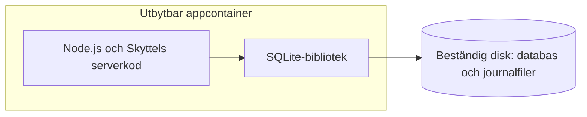
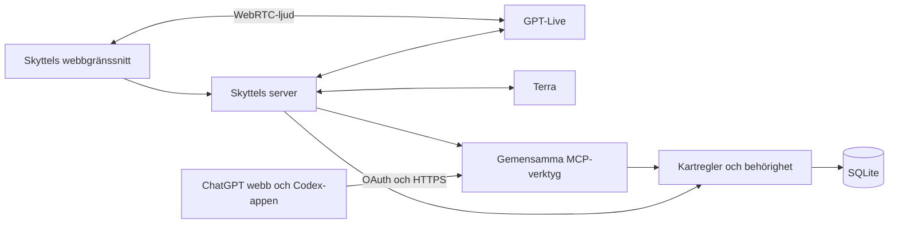
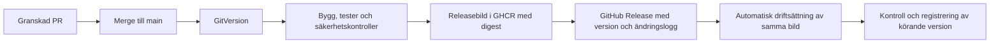

# Förslag till Skyttels teknikbeslut

Detta är ett granskningsunderlag, inte en avslutad resolution.
Beställaren lutar åt Render som första driftvärd, framför allt för
att en vanlig appcontainer och SQLite minskar arbetet vid ett senare
leverantörsbyte. Det samlade teknikbeslutet är ännu inte fastställt.
Gemensam grund och två kompletta driftalternativ föreslås nedan.
Första implementationen bygger ett av alternativen. Inget teknikval
är godkänt genom att det står i detta underlag.

## Ramar

- Låg driftkostnad prioriteras. Cirka 200 kr per månad är ett riktmärke,
  inte ett tak. Befintliga ChatGPT/Codex-abonnemang räknas separat.
- Domän och DNS finns redan hos Cloudflare och Gandi och räknas
  separat i samtliga driftalternativ.
- Egen fullständig export räcker tills vidare. Ingen extra automatisk
  backup eller garanterad högsta dataförlust ingår. Vid större haveri
  kan allt som saknas i egen export gå förlorat. Flera dygns avbrott
  är acceptabelt.
- Hushållsdata är privata. Gemensam karta, privata utkast, egna
  inloggningar och administratörsgränser följer tidigare beslut.
- Google och Microsoft är första inloggningsvägen. Egna lösenord är
  reservväg om ett konkret hinder gör leverantörsinloggningen för svår.
- Extern text i ChatGPT på webben och Codex-appen ingår. Externt tal
  ingår inte. Skyttels eget svenska talflöde kvarstår.
- Säkerhets- och sårbarhetskontroller samt en underhållen väg för
  uppdateringar ska ingå. Beställaren väljer automatiska förslag och
  tester, manuellt godkänd merge till `main` och därefter automatisk
  driftsättning i Render när releasekontrollerna lyckas.
- GHCR lagrar den publicerade containerbilden. Releasen kopplar ihop
  källkodscommit, version och bildens digest. Render kör exakt den
  publicerade bilden från GHCR.
- GitVersion beräknar versioner enligt Kravhanterings releaseprinciper.
  GitHub Releases dokumenterar version, ändringslogg och kopplingen till
  den bestämda containerbilden i GHCR.
- Chrome på Windows, macOS, iPhone och iPad är målplattformar. Tidigare
  avgränsningar av faktisk verifiering kvarstår; offlinearbete ingår inte.

## Föreslagen gemensam grund

<!-- markdownlint-disable MD013 -->
| Del | Förslag och skäl |
| --- | --- |
| Webbgränssnitt | TypeScript, React och Vite, med React Router för sidvägar. Delad redigeringslogik för lista, detaljer och karta. |
| Rymdvy | Three.js med WebGL 2 för kamera, objekt, linjer och träfftestning. HTML/SVG för läsbara etiketter och vanliga kontroller. |
| Serverkod | TypeScript med Hono för HTTP och anslutning till inloggning, administrations-API och MCP. Körmiljön följer driftalternativet. |
| Identitet | Better Auth med Google och Microsoft samt dess OAuth-provider för externa MCP-klienter. |
| Kartlagring | Relationsmodell i SQLite, med versionsstyrda SQL-migreringar. Databasåtkomst och transaktioner följer driftalternativet. |
| Bilder | Omkodade bildversioner som BLOB i hushållets databas. Endast slutbilden sparas, högst 300 × 300 bildpunkter och en kontrollerad bytegräns. |
| AI | GPT-Live-1 med marin, WebRTC och client-delegering; GPT-5.6 Terra low för kartarbete, enligt det godkända talprovet. |
| MCP | Officiellt TypeScript-SDK, Streamable HTTP över HTTPS. Samma verktyg används av egen assistent och externa klienter. |
| Flyttbarhet | Eget versionerat exportformat och tydlig gräns mellan kartregler och leverantörens lagring. |
<!-- markdownlint-enable MD013 -->

Detta är ett förslag om bibliotek och struktur. Den fulla kombinationen
är inte produktionsverifierad. Paketens stödversioner fastställs vid
implementationen; prototypens versionsnummer blir inte produktkrav.

Python kan bära servern och används i prototypen, men TypeScript ger
gemensamma datatyper och valideringsscheman med webbgränssnittet.
React Router och Vite ger en webbklient med uttryckliga sidvägar.
Next.js är också möjligt, men inget behov av serverrenderat privat
hushållsinnehåll motiverar dess ytterligare servermodell här.
React kräver fortfarande eget arbete med tillstånd och tillgänglighet.

Three.js ersätter prototypens egen projektions- och kameramatematik.
Prototypen använder SVG och Canvas och fastställer beteenden, inte ett
krav på grafikbibliotek. Three.js ger inte automatiskt rätt gester,
etiketter eller tillgänglighet. Dess CSS2DRenderer väljs inte som
obearbetad etikettslösning, eftersom den dokumenterar en begränsning
till 100 procents webbläsarzoom.

## Två driftalternativ

### A: Render Hobby med betald app och SQLite

- En Node.js LTS-app i en portabel container levererar webbklient,
  HTTP-API, inloggning, MCP och talets serverarbete.
- Hobby-arbetsytan kostar 0 USD. Betald app kostar 7 USD och 1 GB
  beständig disk 0,25 USD per månad. Startstorleken är ett mätbart
  förslag; större faktisk förbrukning kan kräva högre kostnad.
- SQLite nås genom better-sqlite3. Auth, medlemskap, privata utkast,
  karta, historik, kvitton och bilder kan ligga i samma databas.
- Sharp validerar och omkodar bilder på servern.
- Frankfurt föreslås. Domän och DNS ligger kvar hos Cloudflare och
  pekar mot Render; HTTPS ingår. En ensam driftoperatör ryms i Hobby.
- Appen har en instans. Uppdatering ger ett kort avbrott och disken
  kan inte delas av flera parallella instanser.

Detta ger enklast server- och lagringsmodell av de två förslagen.
En vanlig container och databasfil förenklar en senare flytt till
en annan appvärd eller egen server. Ingen separat köserver, databas-
tjänst eller backuptjänst ingår.

### Container, databas och byte av driftvärd

Render-förslaget har en appcontainer och en separat beständig disk.
SQLite är en databasmotor som körs som bibliotek i Node-processen.
Det finns därför ingen separat databasserver eller databascontainer.
Applikationskoden ligger i containerbilden; databasfilen och dess
journalfiler ligger i en katalog på den monterade disken.

**Uppdatera applikationen på Render:**

1. Bygg en ny containerbild från samma Dockerfile och den nya koden.
2. Render stoppar den gamla appinstansen och startar den nya med samma
   beständiga disk. Detta ger ett kort avbrott; disken förhindrar att
   gammal och ny instans kör samtidigt med denna lagring.
3. Den nya versionen öppnar befintlig databas. Om databasstrukturen
   behöver ändras kör appens startflöde versionsstyrda migrationer
   innan den tar emot trafik. Renders pre-deploy-steg kan inte nå
   den beständiga disken.

Att återgå till en äldre containerbild återställer inte databasfilen
eller dess struktur. Migrationer måste därför bedömas tillsammans med
vilka appversioner som kan använda databasen. Containerbyte och byte
av databasversion är skilda åtgärder.

**Flytta innehållet till en ny installation via export och återimport:**

- Välj en värd som kan köra motsvarande Linux-container och montera
  en beständig disk med filsystem som fungerar med SQLite. Alla
  containerprodukter har inte sådan lagring. WAL lämpar sig inte för
  att flera värdmaskiner delar databasfilen över nätverksfilsystem.
- Gör Skyttels fullständiga export. Den omfattar karta, historik,
  bildversioner, privata utkast, personliga vyer och nödvändiga
  historiska identiteter. Exportfilen är det som flyttas; varken
  Renders disk eller den råa SQLite-databasfilen behöver följa med.
- Starta en ny installation med tom databas hos den nya värden.
  Första administratören loggar in och importerar exportfilen enligt
  reglerna nedan. Den nya installationen måste stödja exportformatets
  version, direkt eller genom en uttrycklig formatmigrering.
- Konfigurera diskens sökväg, miljövariabler, serverhemligheter,
  hälsokontroll och HTTPS hos den nya värden. Hemligheter flyttas
  separat och ska aldrig läggas i källkod, containerbild eller
  hushållets export.
- Koppla historiska användare till nya inloggningar med uttrycklig
  identifiering. Gamla sessioner och OAuth-token exporteras inte.
  Tidigare medlemskap får inte automatiskt ge ny åtkomst; vid behov
  ansluts externa klienter på nytt.
- Verifiera innehåll och inloggning och styr sedan den egna domänen
  till den nya värden. Behåll ett enda ställe som tar emot skrivningar
  och pausa ändringar i den gamla installationen från den slutliga
  exporten tills den nya tar över. Samma publika adress förenklar
  OAuth-inställningarna;
  ändrad adress kräver kontroll av registrerade återkopplingsadresser.

Export och återimport är den rekommenderade flyttvägen. Den lägger
inte till automatisk backup. Containerbilden flyttar programmet;
exportfilen flyttar hushållets innehåll. Importen får inte vara
beroende av åtkomst till den gamla disken eller databasfilen.

En framtida Skyttel-version med exempelvis PostgreSQL kan ta emot samma
exportformat om dess importfunktion stöder det. En sådan version kräver
fortfarande implementation av databasåtkomst och import för PostgreSQL;
containerbyte byter inte databasmotor automatiskt.

Att flytta en konsekvent SQLite-kopia är en teknisk möjlighet, men inte
ett krav på användaren eller den planerade flyttvägen. En sådan kopia
får inte göras genom att bara kopiera en aktiv huvudfil och lämna dess
WAL-journal; beständiga ändringar kan ännu ligga i journalen.

**Skillnaden mot Cloudflare-spåret:**

Render-spåret använder vanlig Node.js, SQLite, filåtkomst och HTTP.
Render-specifika inställningar begränsas främst till driftsättningen.
Samma containerupplägg kan användas hos en annan passande värd.
En annan processorarkitektur kan kräva att containerbilden byggs om
från samma Dockerfile; flyttbarheten ligger även i det byggreceptet.

Cloudflare-spåret använder Workers körmiljö, D1, Durable Objects och
Images-binding. Dessa gränssnitt och deras transaktions- och
sessionsregler påverkar serverkoden. Webbgränssnittet och fristående
kartregler kan fortfarande återanvändas, men byte till en vanlig
container innebär att dessa integrationer och dataflytten behöver
anpassas. Det behöver inte vara flera separata kodförråd; skillnaden
är beroendet av Cloudflares tjänster och körmodell.

Källor:
[SQLite som inbyggt bibliotek](https://www.sqlite.org/serverless.html),
[Docker på Render](https://render.com/docs/docker),
[Renders beständiga diskar](https://render.com/docs/disks),
[driftsättning](https://render.com/docs/deploys),
[återgång till tidigare appversion](https://render.com/docs/rollbacks),
[SQLite Backup API](https://www.sqlite.org/backup.html) och
[SQLite WAL](https://www.sqlite.org/wal.html).
Cloudflare-jämförelsen utgår från
[D1:s Worker-gränssnitt](https://developers.cloudflare.com/d1/worker-api/),
[Durable Objects och D1](https://developers.cloudflare.com/durable-objects/best-practices/access-durable-objects-storage/)
och [Node.js-stödet i Workers](https://developers.cloudflare.com/workers/runtime-apis/nodejs/).

### B: Cloudflare Workers Paid med D1 och Durable Objects

- En Worker levererar webbklient, HTTP-API, inloggning och MCP.
  Grundpriset är 5 USD per månad med inkluderade användningskvoter.
- Better Auth använder D1 för identiteter, sessioner och OAuth-token.
  Varje hushåll har ett Durable Object med SQLite för medlemskap,
  roller, hushållsbundna medgivanden och allt hushållsinnehåll.
- Samlat sparande använder objektets transactionSync, inte en lokal
  SQLite-drivrutin eller en SQL-transaktion över två databaser.
- Objektet kontrollerar medlemskap och medgivandets ID vid själva
  sparandet. Återkallelse ändrar samma tillstånd och kvitteras först
  när ändringen är beständig; gamla token ger därmed inte ny åtkomst.
  D1-token kan städas separat. Även läsning och pågående modelljobb
  måste kontrollera aktuell åtkomst.
- Cloudflare Images-binding omkodar privata bildbytes. Slutbilderna
  lagras i hushållsdatabasen; separat köpt Images-lagring ingår inte.
- Talets session har uttryckligt ansvar i Durable Object, beständiga
  operationsuppgifter och aktiv klientkommunikation. Återanslutning
  och avslut hanteras när klientkontakten försvinner. waitUntil är
  ingen ersättning för detta. En utgående WebSocket kan inte ensam
  hålla objektet levande obegränsat.

Detta ger cirka 28 kr lägre grundkostnad i månaden med räkneantagandena.
Mer kod beror på Cloudflares transaktioner, lagringsgränser och
livscykel. Portering kräver att dessa delar ersätts. D1 och hushållets
objekt ska inte behöva en gemensam transaktion för ett kartbeslut.

### Gemensam avgränsning

Gemensamma datatyper och exportformat föreslås. Två färdiga driftvägar
eller ett generellt ramverk för alla leverantörer ingår inte i första
implementationen. Den valda lösningen byggs och verifieras.

## Gränser mellan delarna

MCP-verktygen och webbens formulär anropar samma regler för kartarbete.
Den egna assistentens verktygsanrop går genom MCP. Administrativa
funktioner exponeras bara i Skyttels eget gränssnitt och API.
Modellnycklar och betrodda behörighetsbeslut finns på servern.

Client-delegering betyder att Skyttel driver kartarbetet. Det innebär
inte att hemligheter eller beslut om åtkomst ska ligga i webbläsaren.
Egen serveradapter kontrollerar resultaten före kort återkoppling till
Live; bekräftelse om sparande bygger direkt på ett beständigt kvitto.

## Lagring och samlat sparande

SQLite är en relationsdatabas, även när gränssnittet visar ett nätverk.
Ett litet hushåll kan använda flera klienter genom samma server.
Skrivningarna genomförs i korta transaktioner; ingen transaktion hålls
öppen medan en modell eller användare svarar.

Lagringen skiljer på:

- hushåll, Skyttel-användare, inloggningsidentiteter och medlemskap;
- typade objekt, samband och uppgifter om okänt, osäkert eller inget;
- användarens privata utkast och dess version;
- användarens personliga placeringar och visningsinställningar;
- sparade ändringsgrupper, tidigare värden och författare;
- bildversioner och deras referenser;
- operationsidentiteter, versionsunderlag och beständiga resultat.

Objekt och samband har stabila ID:n, hushållskoppling och revisioner.
Databaskrav och servervalidering skyddar referenser och tillåtna
domänkombinationer. Bilder hämtas separat från vanliga kartläsningar.
Historik och borttagna uppgifter har ingen automatisk tidsgräns.

Ett sparande kontrollerar aktuellt medlemskap, exakt utkastversion,
berörda värden och domänvillkor. Karta, historik, förbrukad utkastversion
och kvitto skrivs tillsammans. Ett återförsök med samma operations-ID
och samma innehåll returnerar samma resultat; ändrat innehåll under
samma ID avvisas.

”Ändra priset och spara” får slutföra hela det resulterande utkastet
utan ett extra ja enbart för den begärda rättelsens nya version.
Oväntade ändringar från en annan klient är ett annat fall.

Även ändringar av själva utkastet kontrollerar föregående version så
att en äldre klient inte tyst skriver över nyare arbete.
Samtidigt arbete från samma användare ändrar utkastversionen och kan
göra en granskning inaktuell. Andra användares oberoende ändringar
bevaras. Överlappande ändringar visas som konflikter och kräver ett
nytt aktuellt sparbesked. Ångring skapar ett nytt förslag mot dagens
läge; den ersätter inte hela kartan med en gammal ögonblicksbild.
Servern gör oklara och nyliga operationer sökbara för rätt användare
även från en annan enhet. Återhämtning kräver därför inte att den
ursprungliga webbläsaren fortfarande minns operations-ID.

Render-varianten använder SQLite WAL och full synkronisering för normal
beständighet. Cloudflare använder Durable Objects beständiga lagring
och transaktioner. Utkast, kvitton och personliga vyer ska överleva
vanliga omstarter och driftsättningar i båda fallen. Det är skilt från
den accepterade förlusten när lagringen förstörs. Bilder och historik
räknas in i lagringsförbrukningen.

## Inloggning och externa klienter

Google och Microsoft kopplas till en stabil Skyttel-användare.
Hushållstillgång kommer från ett aktuellt medlemskap, aldrig enbart
från en e-postadress eller modellens uppgivna namn.

Länkning av två inloggningssätt kräver ett uttryckligt flöde som bevisar
båda identiteterna. Samma e-postadress ska inte tyst slå ihop användare.
Privata Microsoft-konton ska ingå i appregistreringens kontotyper.
Registreringar och klienthemligheter behövs hos respektive leverantör.

ChatGPT och Codex får eget medgivande till Skyttels MCP-ingång via
OAuth. Medgivandet gäller identifierad användare, valt hushåll och
kartarbete. Varje anrop kontrollerar token och aktuell åtkomst i Skyttel.
Indraget medlemskap eller återkallad anslutning stoppar fortsatt åtkomst
även om klienten behåller en gammal token eller öppen förbindelse.

Externa klienter får karta, eget utkast, historik och ångring enligt
beslutet. Export, återimport, permanent radering och användarhantering
förblir administrativa funktioner i Skyttel. Verktygsbeskrivningar
förmedlar sparregeln och ger en inloggningskrävande länk till rätt
administrativa sida.

ChatGPTs pluginväg och Codex-appens MCP-anslutning är olika klientvägar.
Riktig fjärranslutning, OAuth, återkallelse och klienternas sparflöde ska
verifieras i implementationen. Det tidigare provet belägger lokal CLI
med text, inte den färdiga produktionsanslutningen.

## Export, återimport och radering

Administratören hämtar en sammanhållen, versionerad ZIP-fil: manifest,
JSON med allt unikt hushållsinnehåll och alla nödvändiga bildversioner.
Formatet innehåller kontrollsummor och stabila identiteter. Historik,
utkast och personliga vyer ingår; administratörens insyn genom export
ska framgå. API-nycklar, sessioner och aktiva OAuth-token ingår inte.

Render-exporten använder en konsekvent SQLite-läsbild. Cloudflare
skapar en uttrycklig, tillfällig exportögonblicksbild av allt innehåll
i hushållsobjektet som sedan kan läsas i delar. Även utkast och egna
vyer omfattas; enbart kartans versionsnummer räcker inte. Tillfälliga
exportkopior omfattas av radering och tas bort när de inte behövs.

Import validerar formatversion, storlekar, referenser och bilder före
ändring. Kända äldre format får uttryckliga migreringar; nyare eller
okända format avvisas utan att befintligt innehåll ändras.

Innehållet byggs i ett separat förberedelseläge och ersätter hushållets
aktuella innehåll i en transaktion. Befintliga medlemskap, roller,
inbjudningar och inloggningskopplingar bevaras. En ny installation
börjar med att första administratören loggar in, importerar och
kopplar historiska användaridentiteter med uttrycklig identifiering.
Historiska författare och privata utkast bevaras även för personer
som inte får ny åtkomst. Gamla användare återfår inte tillgång
automatiskt. Exporterad identitet är aldrig bevis för inloggning;
en omappad identitet bevaras utan åtkomst. Ett nytt versions-ID för
hushållets innehåll gör gamla klienter och sparunderlag inaktuella.
Ett återförsök från tidigare innehållsversion avvisas uttryckligen.

Vid haveri startas en tom installation och egen export återimporteras.
Ingen extra automatisk backup eller separat backupförvaring ingår.
Renders disksnapshots räknas inte som återställningsväg för databasen.

Permanent radering tar bort berört innehåll från aktuell karta,
historik, borttagningar, utkast och bildversioner. Operationsresultat
och cache får inte göra innehållet åtkomligt igen. Databasens journaler
och frigjorda utrymme behöver hanteras i samma raderingsrutin.
Redan nedladdade exporter påverkas inte och kan återföra information
vid en senare uttrycklig import, enligt tidigare informationsbeslut.

Leverantören kan ta interna kopior även utan ett backupval i Skyttel.
Render dokumenterar dagliga disksnapshots med minst sju dagars retention;
det anger ingen verifierad övre gräns. Cloudflares återställningsfunktioner
har också egna lagringstider. Förslaget är att använda leverantörernas
vanliga villkor: permanent radering tar bort åtkomligt innehåll i
Skyttel, men lovar inte omedelbar fysisk radering ur alla interna kopior.
Den begränsningen ingår i förslaget som beställaren behöver bedöma.

## Avbrott och återupptagning

- Vid nätavbrott visas att anslutningen saknas. Senast mottaget utkast
  finns på servern. Osänd text eller tal får inte beskrivas som sparat.
- Vid uteblivet sparbesked är resultatet okänt. Klienten frågar efter
  operationsresultatet före nya ändringar eller ett nytt sparförsök.
- Vid modellavbrott kan vanliga formulär och kartarbete fortsätta när
  appserver och databas fungerar. Ett talavbrott ångrar inget sparande.
- Vid app- eller databasavbrott kan inga beständiga ändringar bekräftas.
  Återanslutningen läser aktuellt utkast och väntande operationsresultat.
- När en röstsession avslutas eller tappar sin användbara anslutning
  avslutas även tillhörande serverarbete där det är möjligt. Redan
  genomfört sparande och oklara utfall kontrolleras separat.
- Render-driftsättning på en appinstans ger avbrott. Versionerade API-kontrakt,
  migrationskontroll och tydlig omladdning hindrar gamla klienter från
  att skicka ett inaktuellt sparunderlag efter uppdateringen.

## Presentation och placeringar

Lista och detaljpanel ger hela vanliga arbetsflödet med tangentbord
och skärmläsare. Rymdkartan delar samma tillstånd och redigeringsregler.
Rendering och kamerarörelser hanterar minskad rörelse, ändrad visningsyta
och bortfall av grafikkontext; utkastet ska inte försvinna om kartvyn
måste återskapas.

En enkel, stabil startplacering sprider nya objekt nära deras samband.
Det innebär inget krav på en generell automatisk layoutmotor.
Befintliga personliga placeringar flyttas inte automatiskt när AI
föreslår ändringar. Användaren kan
flytta objekten. Etiketter, täthet och läsbarhet får samma begränsningar
och verifieringsbehov som tidigare beslut anger; biblioteket bevisar
inte dessa kvaliteter. För personliga placeringar föreslås versionskontroll
per objekt så att oberoende flyttar kan sparas. En föråldrad flytt av
samma objekt avvisas med synligt besked och aktuell placering visas;
användaren kan göra om flytten. Visningsinställningar får motsvarande
versionskontroll, utan en separat avancerad synkmotor.

## AI-data och kostnadsuppföljning

Skyttel sparar nödvändigt utkastunderlag men inte ljud eller fullständiga
samtal beständigt. API-anrop använder `store: false`. Teknisk loggning
innehåller inga hushållstexter, bilder, token eller ljud. Relevanta
kartdelar skickas till den valda modellvägen för det aktuella uppdraget.

Global OpenAI-API är den prövade utgångspunkten. Databasens placering i
EU betyder inte att all AI-behandling sker där. Vanliga API-villkor
kan innebära missbruksloggar upp till 30 dagar med angivna undantag
och separat cachelagring. EU-avtal och ZDR ingår inte som förutsatt
kontobehörighet. Extern ChatGPT/Codex-historik följer klientens villkor.
Det tydliga valet av extern behandling följer tidigare åtkomstbeslut.

En enkel månadsöversikt visar uppskattad drift och förbrukning av Live
och Terra var för sig. Rapporterad användning hämtas när den finns.
Kraschade sessioner eller saknade slutvärden visas som osäker uppskattning.
Riktmärket 200 kr utlöser inget automatiskt hårt stopp. Ingen separat
övervakningstjänst behövs för denna grundfunktion.

Räkneantaganden: 10 SEK/USD och hypotetiskt 25 procents skattepåslag.
AI-exemplet är 3 USD Live och 1,47 USD Terra per öppen samtalstimme.
Det antar 30 kartuppdrag/timme med två anrop, 5 000 indatatoken och
1 000 utdata-/resonemangstoken per anrop, med antagen cacheskrivning
och utan cacheträffar.

| Tal per månad | Render med AI-exemplet | Cloudflare med AI-exemplet |
| --- | --- | --- |
| 1 timme | cirka 147 kr | cirka 118 kr |
| 4 timmar | cirka 314 kr | cirka 286 kr |
| 10 timmar | cirka 649 kr | cirka 621 kr |

Faktisk skatt, växelkurs, modellbruk, lagring, textarbete och trafik
kan ändra beloppen. Cloudflare-siffrorna förutsätter att grundkvoterna
räcker. Befintlig domän/DNS och befintliga abonnemang ingår inte.

## Säkerhet och uppdateringar

Säkerhetskontroller och löpande uppdateringar är ett uttryckligt krav.
Kravhantering är referens för arbetssättet. Nedan föreslås en anpassning
till Skyttels enda appcontainer. Beställarens val är automatiska
uppdateringsförslag och tester samt manuellt godkänd merge till `main`.
Det som går in i `main` är avsett att köras och driftsätts automatiskt
när releasekontrollerna lyckas. Inget extra manuellt godkännande krävs
efter merge. Övriga detaljer ingår i det samlade teknikförslaget.

[Källgranskning av Kravhantering och GitHubs stöd](https://github.com/viscalyx/skyttel/blob/a590d9b6cdd06bdfc3e61c86f04df7dc3dd1babc/docs/research/security-maintenance.md)
beskriver återanvändning, begränsningar och observerade inställningar.

### Kontroller före införande

<!-- markdownlint-disable MD013 -->
| Yta | Föreslagen kontroll |
| --- | --- |
| Källkod och arbetsflöden | GitHub CodeQL för TypeScript/JavaScript och GitHub Actions. |
| Incheckade hemligheter | GitHub secret scanning och repositoryts push protection. Upptäckta riktiga nycklar återkallas. |
| Ändrade beroenden | GitHub dependency review i PR:er, Dependabot-varningar och npm audit mot låsfilen. |
| Bygg- och driftkonfiguration | Trivy config för Dockerfile och annan relevant konfiguration. |
| Färdig container | Syft skapar SPDX-SBOM; Grype skannar bildens faktiska komponenter med aktuell sårbarhetsdatabas. |
| Körande testinstallation | ZAP-baseline samt egna tester av inloggning, hushållsgränser, roller, återkallelse, MCP, bildhantering och import. |
<!-- markdownlint-enable MD013 -->

En SBOM är en lista över bildens komponenter. Allmänna skannrar
kompletterar tester av Skyttels egna regler. Säkerhetsproven körs mot
en isolerad installation med påhittade data och testidentiteter.
Produktionsnycklar, hushållsexporter och riktiga AI-anrop behövs inte
för dessa automatiska säkerhetsprov. Testinloggning får inte bli en
åtkomstväg i produktionsbygget.

Kravhanterings hela uppsättning Nuclei-, roll-, API- och aktiva ZAP-prov
kopieras inte automatiskt. Första nivån ovan täcker de viktigaste
ytorna; ytterligare skannrar läggs till där konkreta täckningsluckor
motiverar dem. Trivys dubbla paket- och hemlighetsskanning behövs inte
som ytterligare standardkontroll när dessa ytor redan har tydliga ägare.

Förslaget är att High och Critical blockerar sammanslagning och ny
leverans tills fyndet är åtgärdat eller har ett granskat, avgränsat
undantag. Fynd utan tillgänglig fix försvinner inte ur bedömningen.
Detta är striktare än Kravhanterings containergräns för enbart fixbara
High/Critical. Lägre nivåer följs upp och prioriteras efter faktisk risk.
Läckta hemligheter och misslyckade behörighetstester blockerar också.
ZAP-regler behöver en uttrycklig granskningsbar felpolicy; ett valt
severity-värde ersätter inte verktygets regelbaserade beteende.

Ett undantag anger fynd eller regel, berört paket och version, berörd
bild eller yta, motivering, ansvarig, källunderlag, åtgärdsplan och
gransknings-/utgångsdatum. Utgångna eller felaktiga undantag stoppar
kontrollen. Tyst global ignorering av en sårbarhetstyp föreslås inte.

GitHubs obligatoriska kontroller och releaseflödets slutkontroll ska
upprätthålla detta. Att ladda upp en rapport är inte samma sak som
att stoppa införande. Verktygsfel, saknad rapport eller en obligatorisk
skanning som inte körts ska ge fel; anpassning av kontroller för en
viss ändring måste vara uttrycklig. Rapporter sparas även vid fel.

### Från uppdateringsförslag till driftsatt version

1. Dependabot föreslår versionsuppdateringar varje vecka för npm,
   GitHub Actions och Dockerbasen. Säkerhetsuppdateringar hanteras när
   varningar kommer och väntar inte på veckans ordinarie genomgång.
   Större versionsbyten granskas separat; kompatibla mindre uppdateringar
   kan grupperas så att varje förslag förblir begripligt.
2. Node LTS, pakethanteraren, basbilden och fristående skanningsverktyg
   får en dokumenterad uppdateringsväg och ansvarig. Komponenter som
   Dependabot inte uppdaterar kontrolleras vid veckogenomgången.
   Versionslås, låsfil och referenser hålls samstämmiga. Native-paketen
   better-sqlite3 och Sharp samt installationsskript granskas särskilt
   vid byte av Node, operativsystem eller processorarkitektur.
3. PR:en beskriver ändring, kompatibilitet, säkerhetsfynd och eventuell
   datamigration. Typkontroll, relevanta tester och säkerhetskontroller
   körs. Underhållaren granskar resultatet och godkänner sammanslagning.
   Automatiska förslag är inte automatiskt godkända ändringar.
4. Push till `main` startar en betrodd releasekörning som bygger en
   versionsbunden container från den godkända koden. GitVersion
   beräknar versionen före bygget. Bilden testas och skannas, får SBOM
   och ursprungsattestering och publiceras i GHCR. Releaseversion,
   källkodens commit och bildens digest binds samman. En digest är
   bildens innehållsidentifierare; tidigare releaser skrivs inte om.
5. När releasekontrollerna lyckas verifierar arbetsflödet ursprunget
   och begär automatiskt införande av den exakta bilden i Render via
   API eller deploy-hook. Render kör bilden från GHCR med dess digest.
   Tjänstens sparade bildreferens och införandet hålls samstämmiga,
   även vid senare omstart. En ny registertagg ensam utlöser inte
   införande för en bildbaserad Render-tjänst.
6. Hälsa, version och grundläggande funktion kontrolleras efter byte.
   Först när införandet har lyckats registreras bilden som driftsatt.
   Om byte misslyckas markeras det som misslyckat och faktisk version
   fastställs. Återgång kräver att äldre appkod passar aktuell
   databasstruktur, enligt avsnittet om containerbyte.

Varje lyckad release har en oföränderlig version och en GitHub Release
med källkodscommit, GHCR-referens med digest, SBOM och verifierbart
byggursprung. GHCR-bilden är leveransen som Render hämtar. Ingen
ombyggnad på Render ingår. Den körande versionens identitet finns
tillgänglig för kontroll efter införande och för sårbarhetsbevakningen.

Införandejobbet får bara använda betrodd kod från `main`. Bygg- eller
kontrollfel startar ingen driftsättning och lämnar den tidigare
versionen i drift. Begärd driftsättning är inte samma sak som lyckad
driftsättning: arbetsflödet följer resultat och hälsokontroll, registrerar
faktisk version och larmar vid fel.

Införanden serialiseras. En äldre byggkörning får inte skriva över en
nyare driftsatt version. Inaktuella väntande kandidater hoppas över,
medan en pågående datamigration inte avbryts godtyckligt. Vid fel under
själva versionsbytet fastställs faktisk app- och databasstatus innan
återförsök eller återgång. Detta är förenligt med den enda appinstansens
accepterade korta driftavbrott.

### GitVersion, releaseversion och ändringslogg

Beställaren väljer samma principer som Kravhantering. GitVersion körs
med full Git-historik och taggar, låst verktygsversion och incheckad
konfiguration. Dess .NET-verktyg behövs i byggmiljön, inte i appcontainern.

- `main` använder ContinuousDelivery och etiketten `preview`, exempelvis
  `1.2.0-preview.4`. Dessa releaser markeras som pre-release i GitHub.
  De är ändå de betrodda main-versioner som automatiskt körs i Render.
- Stabila releaser använder taggen `vX.Y.Z` och dokumenteras som vanliga
  GitHub Releases. Git-taggen och releaseplanen ska avse samma commit.
  En äldre stabil tagg får inte automatiskt ersätta en nyare main-version
  i Render; `main` styr den löpande automatiska driftsättningen.
- Standardhöjningen för main är patch. Kravhanterings regler för
  `+semver:`, `feat`, `fix`, `perf` och `BREAKING CHANGE` är utgångspunkt.
  Branchmönster anpassas till Skyttels faktiska namn, inklusive `codex/`.
  PR-etiketter kategoriserar ändringsloggen; de styr inte själva
  GitVersion-höjningen.
- GitVersions byggmetadata efter `+` tas bort ur Docker-taggen och
  GitHub-release-taggen enligt Kravhanterings modell. Full version och
  källkodscommit behålls i byggmetadata. Versionsnamn är läsbara alias;
  digest är den exakta identitet som används vid driftsättning.
- Semantisk version är bildens primära tagg. Main-releaser får även
  alias med kort och full commitidentitet. Samma version får inte
  flyttas till ett annat bildinnehåll vid ett återförsök.

GitHub genererar ändringsloggen med kategorier i `.github/release.yml`.
Kravhanterings kategorier återanvänds och anpassas till Skyttels etiketter:
bland annat säkerhet, funktioner, rättningar, data, MCP/AI, containerdrift,
CI, beroenden och dokumentation. En restkategori fångar oetiketterade
PR:er; bara uttryckligt `ignore-for-release` utesluter en PR.
Preview jämförs med föregående publicerade preview och stabil release
med föregående stabila release. Saknas föregående release i kanalen
hoppar genereringen över jämförelsen med ett förklarande besked; den
får inte tyst använda den andra kanalen.

Releasesidan visar containerpaket, versionstaggar, exakt digest,
källkodscommit, ändringslogg, SBOM och verifierbart byggursprung.
Om GitHubs genererade ändringslogg inte kan hämtas används samma
reservprincip som Kravhantering: releaseinformationen om bilden och
dess underlag kan publiceras, medan bortfallet redovisas uttryckligen.
Oklar eller motstridig koppling mellan version, commit och bild stoppar
publicering och driftsättning. Ett återförsök bevarar redan verifierade
taggar och filer och slutför endast saknade, förenliga steg.

Driftpåverkande ändringar får versionsbunden vägledning i
`docs/operations/operator-upgrade-notes.md` under `Unreleased`.
PR:en anger om vägledningen uppdateras eller inte behövs. Releasen tar
med tillämplig vägledning från sin exakta källkodsrevision. Preview
tömmer inte `Unreleased`; en stabil release arkiverar bara de levererade
avsnitten via en separat PR och bevarar nyare anteckningar.
Åtgärder som måste göras före automatiskt införande ska vara klara före
merge, eller förändringen delas upp så att main-versionen kan införas.

Kravhantering filtrerar vissa dokumentations- och teständringar från
automatisk preview-publicering. Skyttels begärda huvudregel är att
push till `main` startar release- och införandekedjan; dessa filter
kopieras därför inte automatiskt. En inaktuell väntande kandidat kan
fortfarande hoppas över till förmån för en nyare main-version.
Preview-taggar som skapas av main-körningen ska inte starta en andra
releasekörning. En stabil release kan bygga en egen bild; samma digest
lovas inom en releasekedja, inte mellan separata preview- och stabilbyggen.

Källor:
[GitVersion-konfiguration](https://github.com/viscalyx/Kravhantering/blob/562f9d2eccc85a316cf30eaa01a9e4e85c4fbb88/GitVersion.yml),
[releaseplan](https://github.com/viscalyx/Kravhantering/blob/562f9d2eccc85a316cf30eaa01a9e4e85c4fbb88/scripts/release/container-release.mjs),
[release- och ändringsloggflöde](https://github.com/viscalyx/Kravhantering/blob/562f9d2eccc85a316cf30eaa01a9e4e85c4fbb88/docs/development/trusted-container-publishing.md#release-evidence),
[kategorier](https://github.com/viscalyx/Kravhantering/blob/562f9d2eccc85a316cf30eaa01a9e4e85c4fbb88/.github/release.yml)
och [publiceringskontroller](https://github.com/viscalyx/Kravhantering/blob/562f9d2eccc85a316cf30eaa01a9e4e85c4fbb88/scripts/release/publish-github-release.mjs).

Skannade komponenter i containerbilden uppdateras genom en ny release.
Render sköter värdplattformen, men uppdaterar inte automatiskt vår
inbyggda Node-version, våra npm-paket eller containerbildens OS-paket.
En mindre runtime-bild med underhållen Node-bas och en app som kör utan
root minskar ytan. Beständig disk måste fortfarande vara skrivbar för
appen. Versionsval och kompatibilitet verifieras i implementationen.

### Återkommande kontroll och åtgärder

Den faktiskt driftsatta bildens digest skannas dagligen med aktuell
sårbarhetsdatabas, även om ingen kod ändras. Detsamma gäller eventuell
kvarhållen version för återgång. Daglig kontroll bygger inte om bilden
och byter inte versionen. En ny lyckad byggkörning bevisar inte att
den körande versionen är uppdaterad.

För varje resultat sparas bildens identitet, skanningstid, verktygs-
och databasversion samt policyutfall. Ett fynd förblir aktuellt tills
det är åtgärdat i drift eller hanterat genom ett giltigt undantag.
Kontrollen bör ge ett samlat aktuellt ärende per bildversion och
meningsfulla uppdateringar, utan dagliga dubbletter. Misslyckad skanning
markeras som okänd status och får inte beskrivas som att bilden är ren.

Underhållaren får GitHubs larm och ansvarar för bedömning och införande.
Mottagare och faktisk leverans av larmen kontrolleras när flödet sätts
upp. Hemliga eller ännu inte offentliga säkerhetsuppgifter rapporteras
privat; publika rapporter får inte innehålla hushållsdata eller token.
En SECURITY.md beskriver kontaktväg, supportomfattning och arbetsgång.
Fixar levereras i en ny version; inget generellt löfte om stöd till alla
äldre releaser eller oavbruten säkerhetsbevakning ingår.

GitHub kan avaktivera schemalagda körningar efter 60 dagars inaktivitet
i publika projekt. Underhållaren kontrollerar därför senaste lyckade
skanning minst månadsvis och före införande, och återaktiverar vid behov.
Detta lägger inte till en extern betald övervakningstjänst.

### Skydd av själva leveranskedjan

- Externa Actions låses till full commit med läsbar versionskommentar.
  Containerbasen låses till vald version och digest. Första automatiska
  uppdateringen av dessa referenser kontrolleras vid uppsättningen.
- PR-kod körs med minsta rättigheter och utan publicerings- eller
  produktionshemligheter. Betrodda release- och införandejobb har
  separata, snäva rättigheter. Ogranskad PR-kod ska inte köras med
  förhöjda rättigheter genom pull_request_target eller motsvarande.
- SHA-låsta Actions kan versionsuppdateras av Dependabot, men får inte
  antas täckas av dess vanliga Action-sårbarhetsvarningar. Underhållet
  omfattar även säkerhetsmeddelanden för CI-verktygen.
- Docker-stödet i Dependabot föreslår versioner men ger inte samma
  säkerhetsuppdateringar som npm. Därför behövs den färdiga bildens
  skanning och en väg från upptäckt till nytt basimage och ny release.
- Reglerna för sammanslagning verifieras även för underhållaren och
  Dependabot. Ingen extra extern granskare förutsätts för detta
  enpersonsprojekt, men kontrollerna ska vara obligatoriska.

GitHubs säkerhetsfunktioner och standardrunners för ett publikt projekt
samt publik GHCR-lagring kan bära detta utan en ny betald säkerhetslicens.
Lagringskvoter, rapporters lagringstid och framtida prisändringar behöver
följas upp. Behåll bilder som används för drift och planerad återgång;
kasta inte deras underlag genom allmän städning av tillfälliga CI-filer.

Kraven ovan inför ingen automatisk säkerhetskopiering av hushållsdata.
Egen export och återimport är fortsatt återställnings- och flyttvägen.

## Verifiering och avgränsning

Detta underlag föreslår en lösning att bedöma; inget är låst och ingen
produktionsverifiering påstås. Implementationen behöver kontrollera framför
allt samtidiga klienter, tappade kvitton, importfel, radering, riktiga
inloggningar, externa MCP-klienter, minnesbehov och grafikrutinens
beteenden på målplattformarna. Tidigare accepterade uppskjutna prov
återinförs inte som villkor för detta planeringsbeslut.

Detaljerade observerbara acceptanskriterier hör till
[Vad ska första användbara Skyttel innehålla och hur vet vi att det räcker?](https://github.com/viscalyx/skyttel/issues/13).
Ingen produktionsdel, tjänstbeställning eller driftsättning ingår här.

## Underlag

- [Drift och lagring](https://github.com/viscalyx/skyttel/blob/96c641dbf5d9f34944f8f285212bb44c7b959c9b/docs/research/hosting-storage.md)
- [AI, tal och MCP](https://github.com/viscalyx/skyttel/blob/64fddd101e4e1ca3437e183f056a113d773c959c/docs/research/ai-mcp-production.md)
- [Cloudflare](https://github.com/viscalyx/skyttel/blob/9964630664215caec5204c4d3999d1527f922d5b/docs/research/cloudflare.md)
- [Säkerhetskontroller och uppdateringar](https://github.com/viscalyx/skyttel/blob/a590d9b6cdd06bdfc3e61c86f04df7dc3dd1babc/docs/research/security-maintenance.md)
- [React: möjliga projektupplägg](https://react.dev/learn/creating-a-react-app)
- [Vite: backendintegration](https://vite.dev/guide/backend-integration)
- [Three.js WebGLRenderer](https://threejs.org/docs/pages/WebGLRenderer.html)
- [Three.js CSS2DRenderer och zoomgräns](https://threejs.org/docs/pages/CSS2DRenderer.html)
- [Hono på Node.js](https://hono.dev/docs/getting-started/nodejs)
- [Hono på Cloudflare Workers](https://hono.dev/docs/getting-started/cloudflare-workers)
- [Better Auth med SQLite](https://better-auth.com/docs/adapters/sqlite)
- [Better Auth OAuth-provider](https://better-auth.com/docs/plugins/oauth-provider)
- [MCP TypeScript-SDK](https://ts.sdk.modelcontextprotocol.io/)
